# Slide 1

IoT Systems

Node-Red

---

# Slide 2

Node-Red

A graphical environment which you can use to connect different components of an IoT system

Built on Node.js

Node:
A box which performs specifi actions
Palette:
Used to extend Node-Red’s capabilities

IoT systems

2

---

# Slide 3

Node-Red: why?

Rapid development of novel IoT applications
Fast to create IoT applications with little to no code
Can be used for edge or cloud applications
Wide range of technologies supported
Out of the box support of MQTT, REST, CoAP
Great community
Easy to find help
Extensible
Possibility to create and import novel capabilities

3

---

# Slide 4

Node-Red in IoT

4

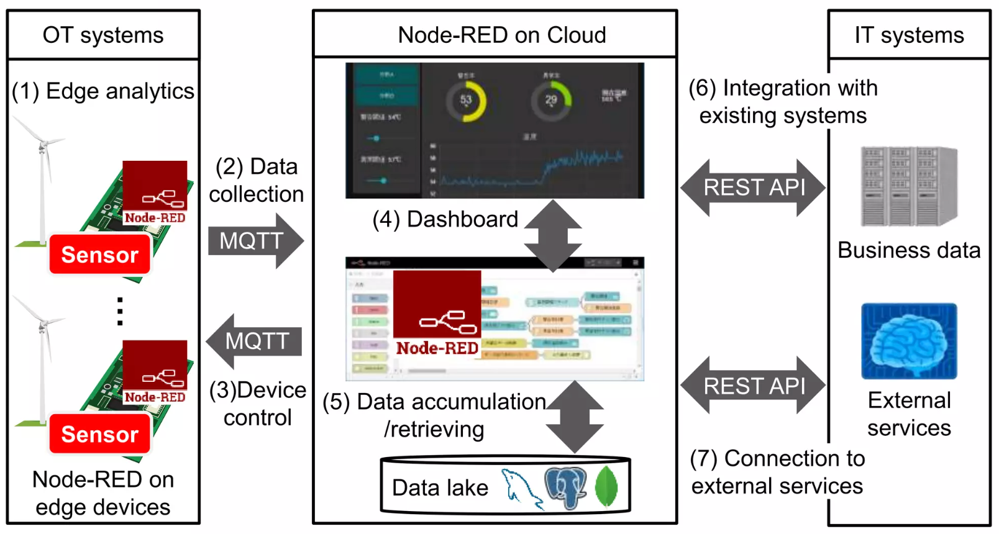

© Hitachi Ltd.

---

# Slide 5

Node-Red: installation

You need Node.js, specifically npm

Another option is through docker

To run it, simply type node-red
There are way more settings which you can configure
You can then access it at localhost:1880

5

---

# Slide 6

Node-Red interface

6

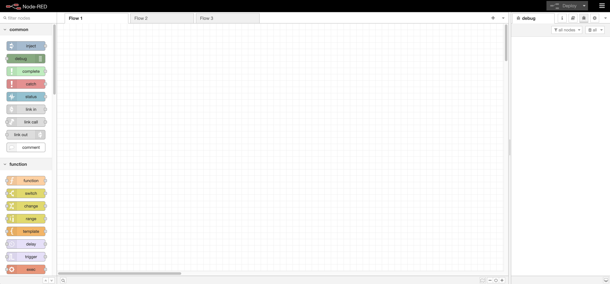

---

# Slide 7

Node-Red interface

7

---

# Slide 8

How a node is made

For every node you may have:
0 or more input links
0 or more output links
A node function
Nodes can also change their look depending on parameters

8

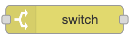

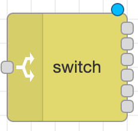

---

# Slide 9

Node types

Generally we distinguish between

Input Nodes

Output Nodes

Processing Nodes

9

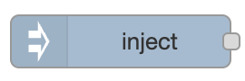

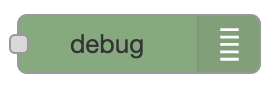

---

# Slide 10

Node details

When you double-click on a node you can edit it
The type and number of details vary from one node to another
Let’s look at

10

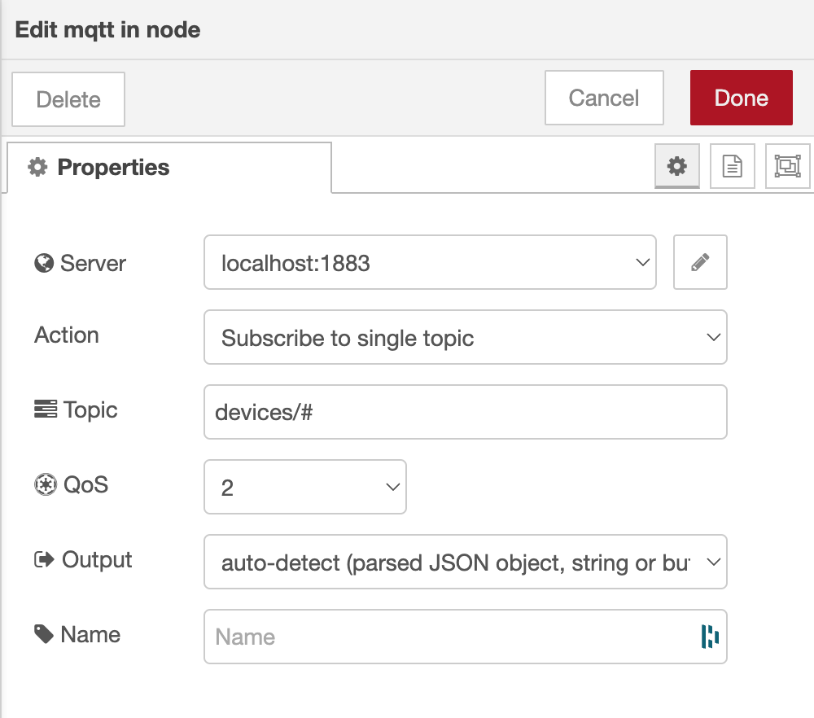

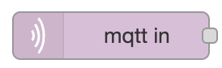

---

# Slide 11

Connecting nodes

You can connet an output link of a node to an input link of another node

Multiple links are also allowed

11

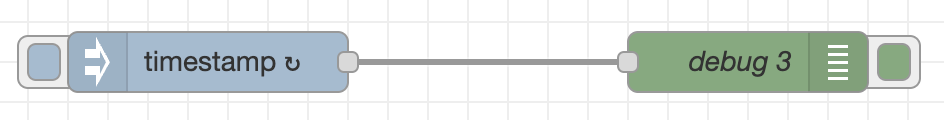

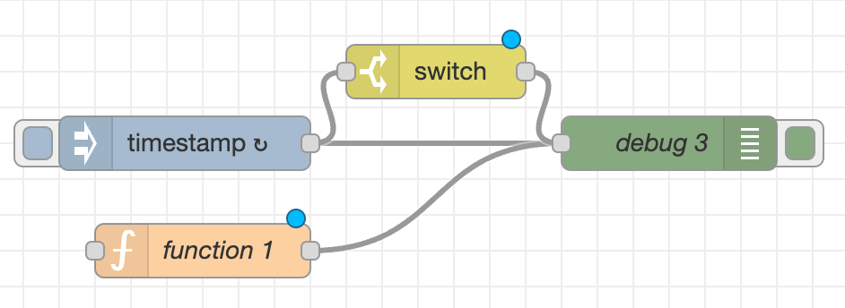

---

# Slide 12

Flows

Nodes are added in flows
You can have as many flows as you want
Useful to group common functions together

When ready, you need to 		  your flows
Each one of them will start to run immediately

12

---

# Slide 13

Node-Red: Hello World

13

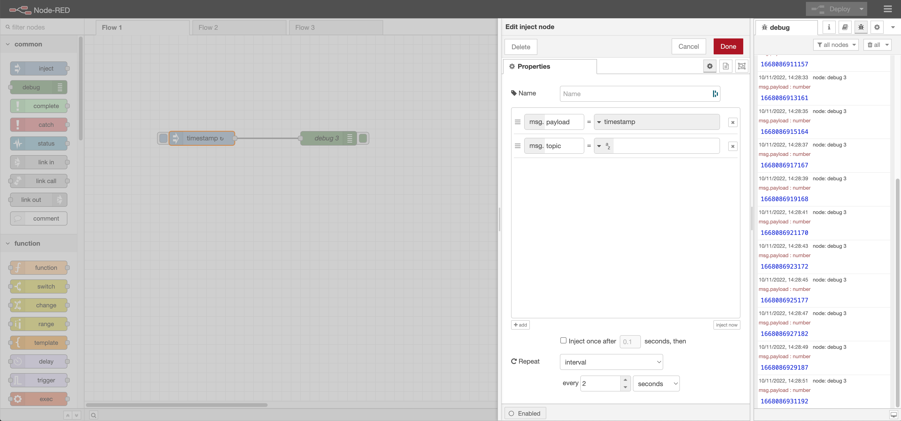

---

# Slide 14

Popular nodes

Injects a message into a flow either manually or at regular intervals. The message payload can be a variety of types, including strings, JavaScript objects or the current time.
Displays selected message properties in the debug sidebar tab and optionally the runtime log. 
A JavaScript function to run against the messages being received by the node.
Route messages based on their property values or sequence position.
Delays each message passing through the node or limits the rate at which they can pass.
Runs a system command and returns its output.

14

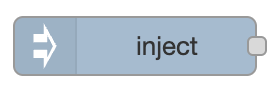

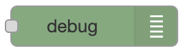

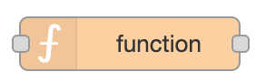

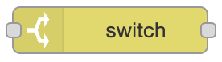

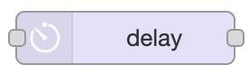

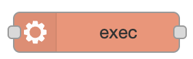

---

# Slide 15

Popular nodes

Connects to a MQTT broker and subscribes to messages from the specified topic
Connects to a MQTT broker and publishes messages.
Sends HTTP requests and returns the response.
Converts between a JSON string and its JavaScript object representation, in either direction.
Writes msg.payload to a file, either adding to the end or replacing the existing content. Alternatively, it can delete the file.

15

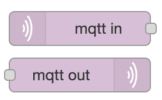

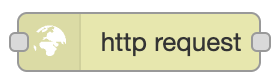

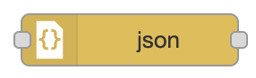

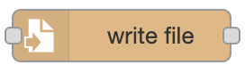

---

# Slide 16

Msg.payload

Usually data is passed through messages, and msg.payload reports the content of them
Generally it is useful to always visualize them in a debug node to get the structure
Then you can pass it to other nodes and remove the debug
The	     node gives you full power over nodes
But it requires Javascript knowledge, and it is usually not necessary
The  	    generally provides everything necessary

16

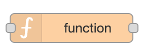

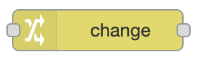

---

# Slide 17

An example

17

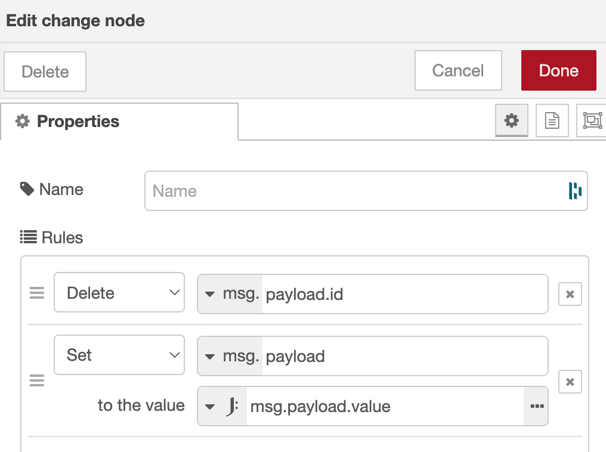

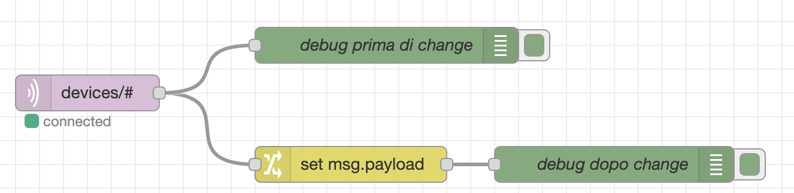

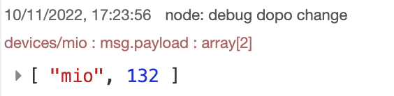

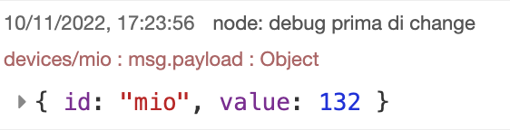

---

# Slide 18

Installing more nodes

Node-Red can change its palette (Menu > Manage palette)
Let’s install support for CoAP

18

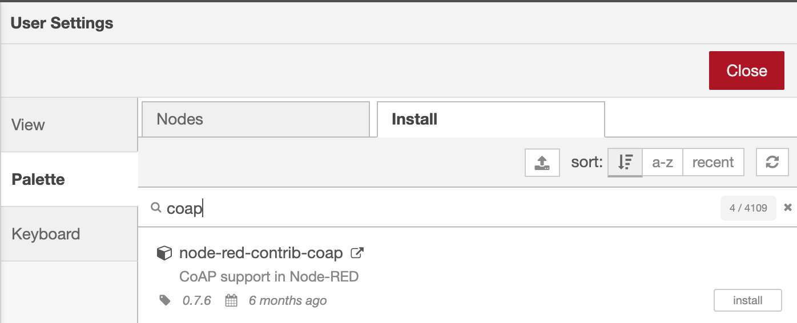

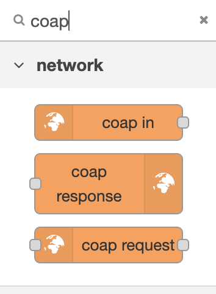

---

# Slide 19

A more complex example

Connect to the MQTT broker
Subscribe to topic devices/#
Save the content of each published message into a file with the name of the field id
Visualize each message in the debug panel

19

---

# Slide 20

Node-Red dashboards

Among the different extensions, an interesting one is the dashboard
It allows to create dashboards directly inside Node-Red
Useful to visualize data rapidly
Can also take inputs by users

20

---

# Slide 21

Node-Red dashboards

Install it: node-red-dashboard

21

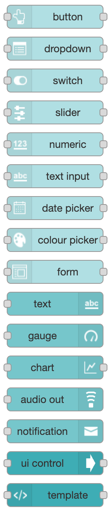

---

# Slide 22

Simple dashboard example

Connect to the MQTT topic values/#
Visualize the data in a Gauge

22

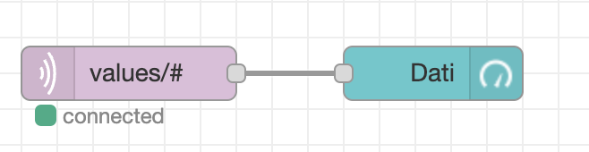

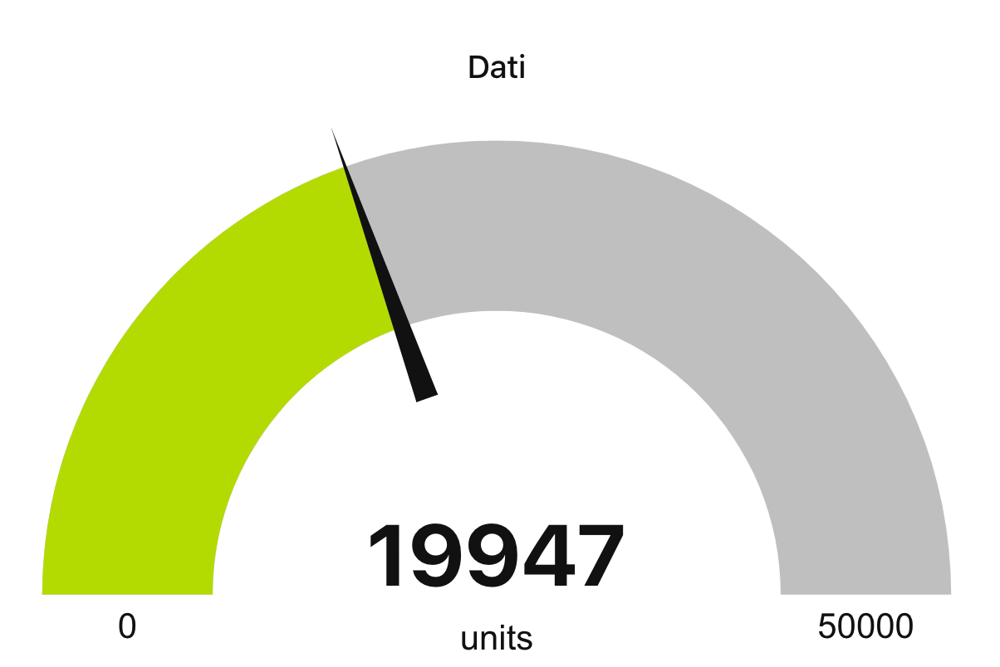

---

